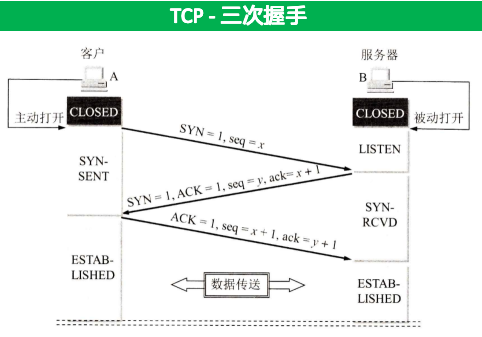
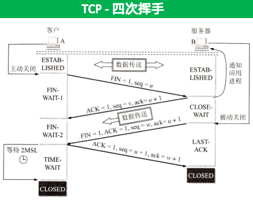
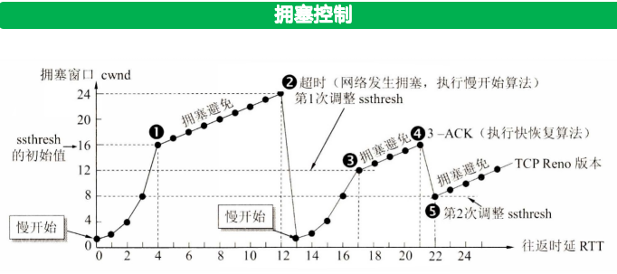

## 概述

### 网络按覆盖范围分类
- 广域网WAN：长距离通信（几十千米到几千千米），交换技术
- 城域网MAN：5-50km，以太网技术
- 局域网LAN：几十米到几千米，广播技术
个人区域网PAN：10m左右
### 网络分类
- 广播式网络：所有联网计算机共享一个公共通信信道。局域网，广域网中的无线、通信卫星网络采用广播式通信。
- 点对点网络：每条物理线路连接一对计算机。广域网基本属于点对点网络。
### 网络拓扑结构
- 总线形：单根传输线，建网容易，增/减结点方便、节省线路。重负载时通信效率不高，对任意一处故障敏感。（局域网）
- 星形：中央设备为交换机或路由器，便于集中控制和管理。成本高，中央设备对故障敏感。（局域网）
- 环形：所有计算机接口设备连成环，环中信号单向传输。（令牌环局域网）
- 网状网络：每个结点至少有两条路径与其他结点相连，可靠性高。控制复杂，线路成本高。（广域网）
### 交换技术分类
- 电路交换网络：建立物理连接，传输数据，断开连接。
    - 优点：数据直接传送，传输时延小。
    - 缺点：建立连接时间长、线路利用率低、不便于进行差错控制。
- 报文交换网络：用户数据+源地址+目的地址、校验码等，封装成报文，传送至相邻结点。
    - 优点：无须建立连接、充分利用线路，线路可靠性高
    - 缺点：转发时延高，缓存开销大，错误处理低效
- 分组交换网络：数据分成较短的固定长度数据块，分组发送到相邻结点。
    - 优点：减少缓存开销、加速传输、减小出错概率、减少重发数据量
    - 缺点：仍存在转发时延，需要传输额外信息量，分组采用数据报形式的时候，可能出现失序、丢失或者重复分组

## 每层的设备总结

- 物理层（直通设备）
    - 中继器：没有存储转发功能，不能连接物理层不同的网络；
        - 不能分割冲突域和广播域
        - 4个中继器串联的5段通信介质只能有三段挂接计算机
    - 集线器：多端口的中继器；物理上是星型，逻辑上是总线型
- 数据链路层
    - 网桥：连接两个或多个局域网，隔离冲突域，不隔离广播域
    - 交换机：多端口的网桥
- 网络层
    - 路由器：连接不同网络，隔离冲突域和广播域

## 物理层

### 基础知识

- 波特率：就是码元传输速率
- 奈氏法则：2Wlog2V，V表示有多少种不同的码元
    - 码元的传输速率有上限，超过会产生码间乱扰
    - 正交调制：QAM-32，V=32；m个相位，n个振幅，V=mn
- 香农定理：Wlog2(1+S/N)，这里的信噪比是无单位的，如果是信噪比(dB)=10log10(S/N)
    - 传输带宽和信噪比确定，信息传输速率上限就确定，只有低于上限，就能找到某种方法实现无差错传输
    - 数据传输速率其实相当于数据的发送速率（和信噪比，传输带宽以及调制速率有关）
- 编码方式：
    - 曼彻斯特编码：码元的中间发生跳变（时钟信号/数据信号）
    - 差分曼彻斯特：码元中间跳变（时钟信号），边界跳变（数据信号）

### 传输介质

- 有线介质：双绞线（屏蔽和非屏蔽两种），同轴电缆，光纤（多模光纤，多次反射，短距离便宜；单模光纤，不反射，长距离贵）
- 无线介质：无线电波，微波，红外线，激光
- 描述物理接口的特性
    - 机械特性：接口的形状，尺寸，引脚排列等
    - 电气特性：接口的电压范围，传输速率，距离限制
    - 功能特性：电压的含义，每条线的功能
    - 过程特性：指明事件发生的顺序

## 数据链路层

### 基础知识

- 两种信道：
    - 点对点信道：PPP一对一通信
    - 广播信道：共享广播信道的有线局域网——CSMA/CD，无线局域网——CSMA/CA
- 链路（物理链路）和数据链路（物理链路+运行在链路上的协议）
- 三个基本问题：封装成帧，透明传输，差错处理
- LLC（向网络层提供四种服务类型）；MAC（介质控制访问，屏蔽物理层的差异）

### 封装成帧（数据链路层的传输单元）

- 字符填充法：特殊字符标记帧的开始和结束，遇到特殊字符进行转义
- 零比特填充法：用比特流(01111110)标记帧的开始和结束，遇到5个连续1时插入0

### 差错检测：

- 奇偶校验：加一位校验位，检测能力弱，只能检测奇数个比特错误
    - 奇校验：1的个数为奇数
    - 偶校验：1的个数为偶数
- 循环冗余校验CRC：生成多项式除法，检测能力强（r位检验能检测出<=r位的错误）
- 海明码可以纠错一位

### 流量控制（没有拥塞控制）与可靠传输

- 和传输层的区别：
    - 数据链路层控制相邻节点的流量，传输层控制的是端到端的流量
    - 数据链路层接收方收不下就不返回确认，传输层接收方通过确认报文控制发送窗口
- 可靠传输有两种机制：确认和超时重传，用这两种可以实现ARQ，ARQ就是你知道的那三种
- 发送周期是从发送方开始发送给分组到**收到第一个确认分组所需要的时间**
- 停止-等待：接收窗口和发送窗口都为1
- 连续ARQ：
    - GBN：接受窗口=1，发送窗口+接受窗口<=2^n
        - u = T_D/(T_D+RTT+T_A)
        - 主要GBN是累计确认
        - 必须按序接受数据
    - SR：接受窗口+发送窗口<=2^n，还有**发送窗口要大于等于接受窗口**，否则永远填不满接受窗口
        - u = nT_D/(T_D+RTT+T_A)
        - 可以缓存，不按序接受数据
- 信道实际的传输速率 = 信道利用率*信道带宽
- 捎带确认的意思是在发送数据的时候顺带发送确认信息，双向通信

### CSMA/CD（载波监听多路访问/冲突检测）

- 先听后发，边听边发，冲突等待，随机重发
- 最短帧长 = 2 * 单向传播时延 * 数据传输速率，10Mb/s为512bit=64B
- 争用期：双向传播时延 = 2 * (距离/2 0000 0000m/s)
- 随机因子：k * 争用期，k = 0 ~ min(2^n-1, 1023)，注意**n是发生了的冲突次数**
- 最大重传16次，超过**丢弃向高层报错**

对于H3——Hub——H4 Hub转发会有1.535us的延迟，链路为100Mb/s，则H3和H4最远可以多远？
即求最大的传播时延，2*（链路传播时延+转发延迟） == 争用期 == 5.12us

### MAC帧，局域网

- 局域网三个特性（传输介质，拓扑结构，介质访问控制）
    - 以太网：逻辑是总线型，物理是星型
    - 一个以太网是一个广播域（通过VLAN可以分割广播域）
- 以太网（有线局域网）不需要帧定界符（目的地址6，源地址6，类型2，数据，FCS4）
    - **FCS要检测首部和数据部分**
    - 最短帧长 = 18 + 数据部分 = 64
    - 数据部分IP数据报不少于46B
- 三种帧
    - 单播：目的地址就是接收方的MAC地址
    - 多播：本局域网上的一部分站点
    - 广播：全1，本局域网上所有站点

### 数据链路层设备

- 网桥：可以隔离冲突域，连接两个以太网就可以成为一个范围更大的以太网，原来的以太网称为一个网段
- 交换机：多端口的网桥
    - 不隔离广播域，但是可以隔离冲突域
    - 提供更大的带宽
    - 检测MAC地址，查找表，若没有：先广播再单播
- 计算机与外界局域网连接是通过网络适配器（串并转换，帧封装，介质访问控制）

## 网络层

### 基础知识

- 功能分为路由选择和分组转发
- 可以连接异构网络（传输介质，数据编码方式，链路控制协议），物理层，数据链路层和网络层协议都可以不同
- 有两种思路（虚电路服务，**没有物理连接，所以不需要预分配带宽**；数据报服务，发现问题，直接丢弃不发送差错报告）
- 有拥塞控制（没有流量控制）
    - 判断拥塞的标准：网络的吞吐量随着网络负载的增加反而下降，这种现象称为网络拥塞
    - 全局性的控制

### IPv4

- 首部——可变
    - 首部长度（以4B为单位，按行来，一行4B
    - 总长度（以1B为单位，16位，故最大长度为65535
    - 标识，数据报的身份证，标识一样的说明是同一个数据报分片
    - 标志位，有三位，第一位没有用；中间位DF，dont fragment；最后一位MF，more fragment
    - 片偏移，15位省了3位，所以单位是8B，也就是**IP数据部分一定是8B对齐，这个要仔细检查**
    - 生存时间，TTL，为0丢弃并发送超时报文
    - 首部校验和：只校验首部
    - 源，目的IP地址，32位
- 五类IPv4地址
    - A: 0xxx
    - B: 10xx
    - C: 110x
    - **D: 1110，多播地址**，多播地址只能用于目的地址，不能用于源地址；IP多播仅应用于UDP
    — E: 1111，保留今后使用
- 特殊地址
    - 主机号全1：直接广播地址，可以进行路由转发
    - 全1：受限广播地址，不能进行路由转发
    - 127：环回，源，目的都是127
    - 0.0.0.0 网络上的本主机
- 默认网关：**连接不同网路的路由器的端口IP地址**，网络中的主机如果想访问其他网络，就直接将分组发送到默认网关
    - 区分好默认网关和默认路由（0.0.0.0/0）
- 移动IP：计算机移到外地时，仍保持原来的IP地址，需要代理

### NAT网络地址转换

- 路由器将内网侧收到的想访问外网的数据报中的源IP地址改为自身的公网侧的IP地址，并添加一个表项(<WAN><LAN>)
- 普通的路由器只工作在网络层，而NAT路由器还有获取传输层的端口号

### 子网划分

- 主机号至少有两位
- 对于一个未划分子网的网络，他的子网掩码就是默认的子网淹没
- 子网划分的注意事项：
    - 记住在划分子网的时候，一定要划分正好的
    - 并且如果有一条线只连了几个路由器，也算是一个网络，别忘了划分（还要加网关）
    - 路由器端口也要分配一个IP地址
    - 不要分配全零和全一

### 分组转发

- ARP请求是广播，ARP相应是单播
- 分片可以在源主机和中间路由器中进行，而重组只在目的主机进行
- ICMP差错报文：用于目标主机或到目标主机路径上的路由器向源主机报告差错和异常情况
    - 终点不可达
    - 源点抑制：由于拥塞
    - 时间超过：TTL==0；当终点在预先规定的时间内不能收到全部数据报片，就把已经收到的全部丢弃然后发送时间超过报文 
        - tracert
    - 参数问题：首部字段有问题
    - 重定向：让人知道下次往别的地方发
- ICMP询问报文：回送请求/回答（ping）；时间戳请求/回答

### 路由选择

- 内部网关协议IGP
    - RIP：距离向量算法，要以更新的消息为准
        - what 整个路由表
        - who 和相邻的路由器
        - when 有变化的时候以及固定间隔时间
        - 如果180s没有收到相邻路由器发来的更新路由表，就标记为不可达
        - 因为发的东西很频繁，UDP
        - 最大距离为15
    - OSPF：基于链路状态路由算法
        - what 相邻的链路状态
        - who 洪泛法，本AS中的所有路由器
        - 链路状态发生变化的时候
        - 可以把AS划分为更小的范围“区域”。洪泛法发至区域内的所有路由器；将路由器区分为区域边界路由器，自治系统边界路由器等等
        - IP层，发很多东西，尽量简洁
- 外部网关协议BGP
    - 基于路径向量算法
    - 不是最优的，策略型
    - 告知相邻路由器自己能到达一个网络的完整路由
    - 基于TCP，网络环境复杂，需要可靠传输

## 传输层

### 基础知识

- 传输层在IP层的基础上加入了“复用和分用”，“差错检验”，除此以外，TCP还提供了流量控制和拥塞控制
    - 复用：发送方不同的应用进程可以用同一个传输层协议传送数据。
    - 分用：接收方的传输层在剥去报文首部后能够把这些数据正确交付到应用进程。

- 网络层提供的是点到点（主机到主机）的通信，而传输层提供的是端到端（进程到进程）的通信
- 对于差错检验（首部和数据部分）
    - TCP：丢弃，要求重传
    - UDP：直接丢弃
- TCP是全双工的可靠通信（不能保证数据按序到达）；UDP是不可靠的无连接通信（可以保证数据按序到达）
- 有关端口
    - 主机之间，协议之间的端口是相互独立的
    - 熟知的端口号是0～1023
    - SOCKET套接字 = IP地址 + 端口号，是唯一标识一个进程的

### UDP

- 面向报文的传输层协议；支持交互通信，不是全双工
- 首部：源端口号，目的端口号，长度（首部+数据），校验和（首部+数据+伪首部）
    - 伪首部：源IP地址，目的IP地址，保留字段（0），协议号（17），UDP长度
    - UDP长度：单位是字节，最小值为8B
    - 校验和：可选的，不用就填0（在校验的时候，按16位运算，不足16位补0）
- 如果目的端口号没有对应的进程，主机会发送一个ICMP不可达报文给源主机

### TCP
- 面向字节的传输层协议；全双工通信

- 在计算时间的时候看清楚至少还是最长